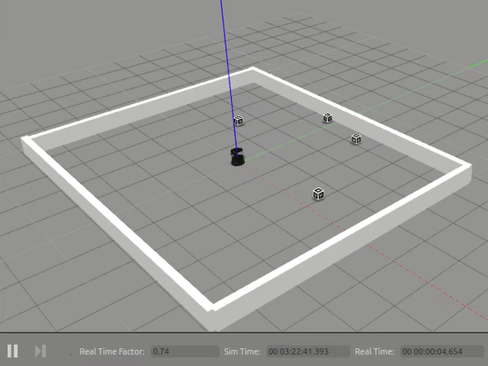
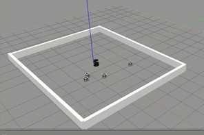

# Project WICKMAN - ROBOT COLLECTOR for ACME Robotics

[](https://travis-ci.org/sanhuezapablo/robot_collector)
[](https://coveralls.io/github/sanhuezapablo/robot_collector?branch=master)
[](https://opensource.org/licenses/MPL-2.0)
---

## Overview
The presence of shareable e-scooters has grown recently, leaving many city sidewalks littered with
scooters that need to be recharged or have maintenance performed. While GPS can be used to track the scooters,
there may be situations where location information is not available. For this cases,  this project developed a robot that can be used to search
for and collect the scooters from unknown locations. To do this, the robot must be able to explore the
environment the scooters are in, visually locate the scooters (using AR tags), and physically collect the scooters.
This project was developed using the turtlebot robot which is going to randownly walk thru an desired area ,while searching for blocks with 
AR tags which they represent the scooters.
Once the block is found it must to simulate a collection.

The developed  project funcionalities are :
  - Place the robot blocks randomly in the simulated enviroment

  - Radomly move the robot to the desired area.
 
  - Avoid obstacles while looking for the scooters;

  - Detect the blocks ;

  - Move into a location where that block can be collected
  
  - Simulate the collection of the block by making it to vanish

In order to properly locate the blocks with the AR tags we used the ar_track_alvar. This packages allows the generation of the AR tags  and 
helps to tracking them by providing the position and orientation when detected by turtlebot.
Once the desired object is detected the robot have to move to a location close to the block to collect, for this step we used move_base ROS
package which generates a path to the goal location and publish the necessary velocities to reach it. 
For the project implementation it was used pair programming which is an software development techinique where programmers work together in order
program and  review each line of code.
This techinique is mostly common withe 2 people, however added one more role:

  - Driver is the one the writes the code.
 
  - Navigator checks each line of code.

  - Design keeper checks the correctness of  the program in a more high level manner.

This software was developed using c++ programming language and the coverage is made with Google Test Framework where many tests were created to
insure the quality of the program. 

## Project Demonstration

In this section it is possible to observe how the project behaves.
Firstly we can see the robot moving randomly, them some brown boxes are added to the environment to become obstacles for the robot .
Once the obstacle is detected the robot is going to turn until the sensor does not detect any obstacle ahead of it.
Once it detect the desired block with the tag, it stops moving randomly and goes closer to the goal direction
When the robot is from a desired distance from the block , it stops and perform the collection.






## Personnel

Andre Gomes - Graduated in Computer engineering From Uniceub in Brazil in 2014. Currently coursing a M. Eng. in Robotics at UMD. Interested in Medical Robotics

Ryan Cunningham - Works for Booz Allen Hamilton as a full-stack software engineer. Graduated with a Computer Science degree from UMBC in 2013.

Pablo - Graduated with a B.S. in Mechanical Engineering from UMCP in 2017. Currently pursuing a M. Eng. in Robotics at UMCP. Highly interested in Machine Learning and Autonomous Robots. 


## License

MPL 2.0 License
Copyright 2019 Ryan Cunningham, Andre Gomes, Pablo Sanhueza

```
Redistribution and use in source and binary forms, with or without modification, are permitted provided that the following conditions are met:

1. Redistributions of source code must retain the above copyright notice, this list of conditions and the following disclaimer.

2. Redistributions in binary form must reproduce the above copyright notice, this list of conditions and the following disclaimer in the documentation and/or other materials provided with the distribution.

THIS SOFTWARE IS PROVIDED BY THE COPYRIGHT HOLDERS AND CONTRIBUTORS "AS IS" AND ANY EXPRESS OR IMPLIED WARRANTIES, INCLUDING, BUT NOT LIMITED TO, THE IMPLIED WARRANTIES OF MERCHANTABILITY AND FITNESS FOR A PARTICULAR PURPOSE ARE DISCLAIMED. IN NO EVENT SHALL THE COPYRIGHT HOLDER OR CONTRIBUTORS BE LIABLE FOR ANY DIRECT, INDIRECT, INCIDENTAL, SPECIAL, EXEMPLARY, OR CONSEQUENTIAL DAMAGES (INCLUDING, BUT NOT LIMITED TO, PROCUREMENT OF SUBSTITUTE GOODS OR SERVICES; LOSS OF USE, DATA, OR PROFITS; OR BUSINESS INTERRUPTION) HOWEVER CAUSED AND ON ANY THEORY OF LIABILITY, WHETHER IN CONTRACT, STRICT LIABILITY, OR TORT (INCLUDING NEGLIGENCE OR OTHERWISE) ARISING IN ANY WAY OUT OF THE USE OF THIS SOFTWARE, EVEN IF ADVISED OF THE POSSIBILITY OF SUCH DAMAGE.

```


## AIP Google Sheet

https://drive.google.com/file/d/1VDC9aNsyO4hMGFzV3Twza4A3Bski4WT-/view?usp=sharing

## Review of Iteration 1 Plan

https://docs.google.com/document/d/1ZHgUjypmwQ1EgH6OiEfFr33gEY65AFu5PCSwR1Sbxzo/edit?usp=sharing


## Review of Iteration 2 Plan

https://docs.google.com/document/d/1que-h1hVN6aHw7FYaeQJNNPZvcynl0JTlDxtLWUCvBE/edit?usp=sharing

## Review of Iteration 3 Plan

https://docs.google.com/document/d/1JDRPVZ6Fz0qZt9qMtWo3nxsUWatqX6YXxdPUHDOhlSU/edit?usp=sharing

## Presentation Slides
https://docs.google.com/presentation/d/1tLeEdNl_gADovLV_jv89rZasCVSgMe8hM1ssqR-rIxQ/edit?usp=sharing


## Dependencies


### Install ROS kinetic

In order to Install ROS kinect follow the following ROS.org [link](http://wiki.ros.org/kinetic/Installation/Ubuntu)

### Install catkin

In order to Install catkin follow the following ROS.org [link](http://wiki.ros.org/catkin#Installing_catkin)

### Install Turtlebot packages

```
sudo apt-get install ros-kinetic-turtlebot-gazebo ros-kinetic-turtlebot-apps ros-kinetic-turtlebot-rviz-launchers

```
### Install ar_track_alvar 

```
sudo apt-get install ros-kinetic-ar-track-alvar

```
### Standard dependencies

  - roscpp

  - rospy 

  - move_base_msgs

  - gmapping slam packages

  - std_msgs

  - sensor_msgs

  - geometry_msgs

  - rostest

  - rosbag

  - tf

## Build Intructions

Create and build a catkin workspace 
```
 mkdir -p ~/catkin_ws/src
 cd ~/catkin_ws/
 catkin_make
 
```
Build Project in Catkin Workspace
```
 cd ~/catkin_ws/
 source devel/setup.bash
 cd src
 git clone https://github.com/sanhuezapablo/robot_collector.git
 cd ~/catkin_ws/
 catkin_make
```

## code coverage

To visualize the code coverage locally  is necessary to have lcov package.
If you do not have it , run the following command.

```
sudo apt-get install lcov

```
once you have the lcov package run the following command to check the code coverage of your files.

```
cd ~/catkin_ws/build
lcov --directory . --capture --output-file coverage.info
lcov --list coverage.info

```
If desired , it is possible to create a html file and save to in a  folder.

```
genhtml coverage.info --output-directory covout

```

## How to run demo

In order to Run the node, the map and the turtlebot at the same time the launch file can be used 

There is no need to initialize the master.

Inside catkin workspace

```
source devel/setup.bash
export GAZEBO_MODEL_PATH=$GAZEBO_MODEL_PATH:`rospack find robot_collector`/World/models
roslaunch robot_collector robot_collector.launch

```


## How to run tests

```
cd ~/catkin_ws/
catkin_make run_tests robot_collector

```


## Known Issues/Bugs

1. The map recorded using gmapping did not exactly match the environment. This is likely due to errors in the Turtlebot localization while it was generating the map.

2. The move_base package's obstacle detection during path planning sometimes resulted in errors where the planner is unable to find a possible solution. In this case, the robot tries to recover but is unable to.

## How to Generate Doxygen Documentation 

How to install Doxygen:

```
sudo apt-get install doxygen
```

Inside the cloned Directory, enter the following terminal commands.

```
 doxygen Doxyfile
```

Opening Doxygen Documentation in Firefox
```
 cd Docs
 cd html
 firefox index.html
```


## Plugins

- CppChEclipse

    To install and run cppcheck in Eclipse

    1. In Eclipse, go to Window -> Preferences -> C/C++ -> cppcheclipse.
    Set cppcheck binary path to "/usr/bin/cppcheck".

    2. To run CPPCheck on a project, right click on the project name in the Project Explorer 
    and choose cppcheck -> Run cppcheck.


- Google C++ Sytle

    To include and use Google C++ Style formatter in Eclipse

    1. In Eclipse, go to Window -> Preferences -> C/C++ -> Code Style -> Formatter. 
    Import [eclipse-cpp-google-style][reference-id-for-eclipse-cpp-google-style] and apply.

    2. To use Google C++ style formatter, right click on the source code or folder in 
    Project Explorer and choose Source -> Format

[reference-id-for-eclipse-cpp-google-style]: https://raw.githubusercontent.com/google/styleguide/gh-pages/eclipse-cpp-google-style.xml

- Git

    It is possible to manage version control through Eclipse and the git plugin, but it typically requires creating another project. If you're interested in this, try it out yourself and contact me on Canvas.
